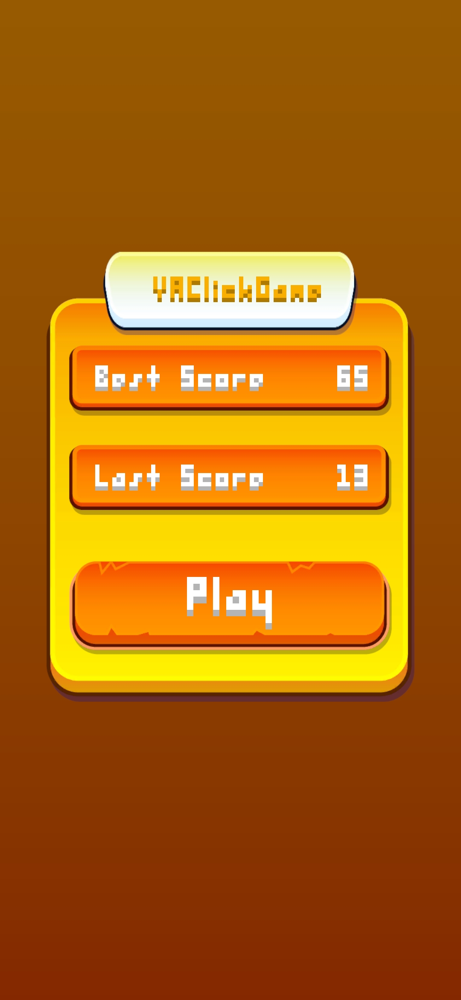
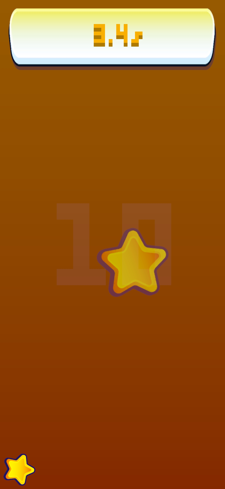

# YAClickGame (Yet Another Clicking Game)

YAClickGame is a minimal open source Android game built with Unity.

The goal is simple:
Tap the screen as many times as possible within 10 seconds.

This is an early prototype. The long-term goal is to evolve the project into a complete game with:
+ Multiple game modes (different time limits or goal to reach)
+ Sound effects and music
+ A shop system (time upgrades, cosmetics, maybe some gadgets ?)
+ More gameplay mechanics...

For now, the application is very minimal.

---

## Features (Current Version)

+ 10-second tap challenge
+ Score counter
+ No ads
+ No trackers
+ No Google Play Services

---

## License

This project is licensed under the MIT License.

---

## Build Instructions

### Requirements

+ Unity 6000.3.x (tested with Unity 6000.3.1f1)
+  Android Build Support module installed

---

### Manual Dependencies

Two libraries must be manually placed inside the Assets/Lib folder:
+ [Pixel Font - Tripfive](https://assetstore.unity.com/packages/2d/fonts/pixel-font-tripfive-64734)
+ [Universal Stylized UI](https://assetstore.unity.com/packages/2d/gui/universal-stylized-ui-270506)

---

## Game Screenshots

